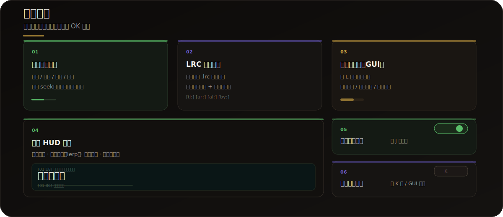
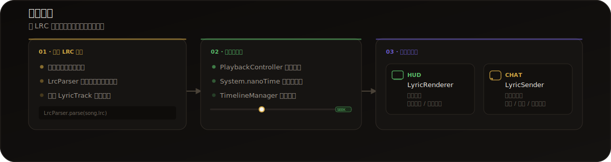

<p align="center">
  
</p>

<p align="center">
  <a href="https://github.com/Eostrehold/LyricLive/actions/workflows/build.yml"></a>
  <a href="https://fabricmc.net"></a>
  <a href="https://fabricmc.net"></a>
  <a href="https://jdk.java.net/25/"></a>
  <a href="./LICENSE"></a>
</p>

> LyricLive 是一个基于 **Fabric 26.1.2** 的纯客户端 Minecraft 模组，让你在游戏中举办卡拉 OK 与唱歌比赛。导入 **LRC** 歌词文件即可在游戏画面中实时显示，并支持自动发送到聊天栏。

---

## 快速开始

仅需 **5 步**，即可在 Minecraft 中享受卡拉 OK：

1. 确保已安装 **Minecraft 26.1.2** + **Fabric Loader 0.19.3+**
2. 下载 LyricLive 模组并放入 `.minecraft/mods` 文件夹
3. 启动游戏，按 **`L`** 键打开 LyricLive 界面
4. 点击"加载歌词"，选择 `.lrc` 歌词文件
5. 按 **`P`** 键开始播放，歌词将自动显示在屏幕上！

> 按 **`J`** 键可快速切换自动发送功能，歌词将自动发送到聊天栏。

---

## 核心功能

<p align="center">
  
</p>

### 歌曲时间控制
- 支持播放 / 暂停 / 继续 / 停止
- 手动调整播放进度（seek），实现歌词同步
- 快进 / 快退，支持设置播放起始偏移
- 基于 `System.nanoTime()` 的高精度时间同步

### LRC 歌词导入
- 解析标准 `.lrc` 歌词文件
- 支持 `[ti:]`、`[ar:]`、`[al:]`、`[by:]` 元数据标签
- 支持 `[mm:ss.SSS]` 毫秒级精度时间戳
- 支持多个时间标签指向同一行歌词
- 支持重新加载 / 切换歌词文件

### 图形化界面（GUI）
- 按 **`L`** 键打开主界面
- 歌词文件列表与文件选择
- 播放控制按钮 + 可点击的进度条
- 独立的设置界面：位置、颜色、大小、透明度等

### 客户端歌词 HUD 显示
- 在游戏画面中实时渲染歌词
- 上下文显示：当前歌词 ± 前 2 行 + 后 2 行
- 丝滑滚动动画（lerp 平滑过渡）
- 淡入 / 淡出效果 + 透明度随距离衰减
- 信息栏：播放状态、当前时间、自动发送状态

### 自动发送歌词
- 根据 LRC 时间轴，自动将歌词发送至游戏聊天栏
- 支持聊天栏直发 / 带前缀指令发送两种模式
- 按 **`J`** 键快速切换开关

### 手动发送歌词
- 按 **`K`** 键或 GUI 按钮随时发送当前歌词
- 自动发送开启时自动禁用手动发送，避免重复

---

## 快捷键速查

| 按键 | 功能 |
|------|------|
| `L` | 打开 LyricLive 界面 |
| `P` | 播放 / 暂停 |
| `O` | 停止播放 |
| `K` | 发送当前歌词 |
| `J` | 切换自动发送 |

---

## 工作流程

<p align="center">
  
</p>

LyricLive 采用清晰的分层架构，数据沿单向管道流动：

```text
┌──────────┐     ┌──────────────┐     ┌──────────────────┐
│ LRC 文件  │ ──> │  时间轴引擎    │ ──> │    双通道输出      │
│ LrcParser │     │ PlaybackCtrl │     │ ┌──────┐┌──────┐ │
│ LyricTrack│     │ TimelineMgr  │     │ │ HUD  ││ CHAT │ │
└──────────┘     └──────────────┘     │ └──────┘└──────┘ │
                                       └──────────────────┘
```

**各层职责：**

- **LRC 解析层**：`LrcParser` 解析 `.lrc` 文件为 `LyricTrack`，包含时间轴与元数据
- **核心控制层**：`PlaybackController` 控制播放状态（播放 / 暂停 / 停止）；`TimelineManager` 通过二分查找确定当前歌词索引
- **显示层**：`LyricRenderer` 在 HUD 上渲染歌词，支持平滑滚动与淡入淡出动画
- **发送层**：`LyricSender` 将歌词发送到聊天栏，支持自动 / 手动两种模式

---

## 配置说明

### 显示配置

| 选项 | 说明 | 范围 |
|------|------|------|
| X 位置 | 歌词在屏幕上方的水平位置 | 0.0 – 1.0 |
| Y 位置 | 歌词在屏幕上方的垂直位置 | 0.0 – 1.0 |
| 字体大小 | 歌词字体大小 | 8 – 64 |
| 字体颜色 | 歌词颜色（十六进制） | `#000000` – `#FFFFFF` |
| 透明度 | 歌词透明度 | 0.0 – 1.0 |
| 阴影 | 是否启用文字阴影 | 开 / 关 |
| 居中 | 是否居中显示歌词 | 开 / 关 |
| 渐变 | 是否启用淡入淡出效果 | 开 / 关 |

### 发送配置

| 选项 | 说明 |
|------|------|
| 聊天发送 | 启用 / 禁用自动发送到聊天栏 |
| 指令发送 | 启用 / 禁用自动发送指令 |
| 指令模板 | 自定义指令格式（`{lyric}` 会被替换为歌词文本） |

---

## LRC 文件格式

LyricLive 支持标准 LRC（LyRiCs）格式：

```lrc
[ti:歌曲标题]
[ar:艺术家]
[al:专辑]
[by:歌词作者]

[00:00.000]第一行歌词
[00:05.000]第二行歌词
[00:10.000]第三行歌词
```

**格式说明：**

- 元数据标签：`[ti:]`、`[ar:]`、`[al:]`、`[by:]`
- 时间标签：`[mm:ss.SSS]`（毫秒级精度）
- 多个时间标签可指向同一行歌词，如 `[00:10.000][00:20.000]重复句`
- 歌词文件放置在 `.minecraft/lyriclive/` 目录下

---

## 开发信息

| 项目 | 版本 |
|------|------|
| Minecraft | 26.1.2 |
| Fabric Loader | 0.19.3 |
| Fabric API | 0.154.0+26.1.2 |
| Java | 25 |
| 构建工具 | Gradle + Fabric Loom 1.17 |

LyricLive 使用 **Fabric** 框架开发，为 **纯客户端** 模组，无需在服务端安装即可使用。编译后的 `.jar` 文件可直接放入 `mods` 文件夹加载。

---

## 许可证

[MIT License](./LICENSE) &copy; 2026 Eostrehold
